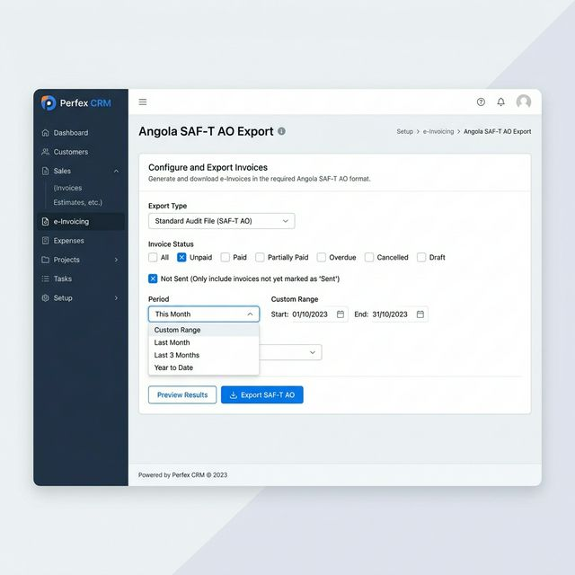
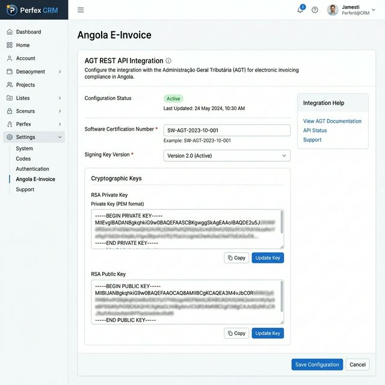

# 🇦🇴 Angola E-Invoice (SAF-T AO) for Perfex CRM

A powerful, secure, and fully compliant electronic invoicing module for Perfex CRM, designed to meet the mandatory requirements of the **General Tax Administration (AGT - Administração Geral Tributária)** of Angola.

---

## 📸 Screenshots

### Advanced SAF-T AO Export Utility

### Module Configuration (AGT Certification)

---

## 🚀 What's New (v1.2.0)
- **One-Click Consolidated Export**: Generates a single, compliant SAF-T AO XML that concurrently aggregates both Sales Invoices (`FT`) and Credit Notes (`NC`), correctly mapping `<DebitAmount>` and `<CreditAmount>`.
- **Dynamic MasterFiles Population**: Automatically traverses all exported documents to construct accurate `<Customer>` and `<Product>` dictionaries embedded directly in the `<MasterFiles>` header.
- **TaxTable Compliance**: Properly structured standard tax mappings (`TaxTableEntry`) for `IVA` inclusion.
- **Native PHP XML Construction**: Deprecated legacy Mustache parsing for the final SAF-T output in favor of rock-solid native PHP logic to eliminate view-render inconsistencies.

## 🚀 Previous Updates (v1.1.0)
- **Advanced Export Utility**: Added a powerful new UI for SAF-T AO global exports.
- **Dynamic Filtering**: Filter exports by **Status** (Paid, Unpaid, Cancelled, etc.) and **Period** (This Month, Last Year, Custom Range).
- **Credit Note Support**: Full export support for Credit Notes alongside Invoices.

---

## 🔥 Key Features

### 🛡️ Digital Security
- **Asymmetric Encryption**: Full RSA-SHA1 signing for all tax-relevant documents.
- **Hash Chaining**: Secure sequential linking for audit integrity (prevents post-hoc document modification).
- **Key Management**: Integrated storage and rotation of RSA Private & Public keys.

### 📤 Compliance & Reporting
- **Advanced SAF-T AO Export**: Flexible utility to generate compliant XML 1.01 files with advanced status and date filters.
- **Real-time API (2026)**: Automatic JSON submission to the AGT REST API gateway for government-cleared invoicing.
- **Auto-Formatting**: Compliant numbering for Invoices (`FT`) and Credit Notes (`NC`).

### ⚡ Seamless Integration
- **Modern Perfex Support (v3.4.1)**: Fully compatible with the latest sidebar navigation and settings hierarchy.
- **Automated Workflow**: Real-time signing and reporting triggered instantly on document creation.

---

## 🛠️ How It Works & Testing

Interested in how this module ensures compliance? Follow these steps to test the end-to-end functionality:

### 1. Module Activation
Navigate to **Setup > Modules** and click **Activate** on "Angola E-Invoice (SAF-T AO)". This will initialize the required database tables (`tblsaft_ao_hashes`) and register the core hooks.

### 2. Configure AGT Settings
Go to **Setup > Settings > Finance > Angola E-Invoice** and enter your credentials:
- **Certification Number**: Your unique software ID (e.g., `001/AGT/2026`).
- **RSA Keys**: Paste your private and public keys in PEM format. These are used for SHA1 digital signing.
- **API Token**: Enter your AGT Portal access token for real-time JSON submission.

### 3. Invoice Creation & Auto-Signing
Create a new Invoice (**Invoices > Create New Invoice**) and save it.
- The module will **automatically sign** the document in the background.
- Each signature incorporates the **hash of the previous document**, forming an unbreakable sequential chain for audit integrity.

### 4. Verify in Activity Log
Check **Utilities > Activity Log** to see the system confirmation:
- `Invoice #XXX signed for Angola SAF-T AO (Hash: xxxxx...)`
- `Invoice #XXX submitted successfully to AGT Portal.`

### 5. Monthly SAF-T XML Export
To generate your tax reporting file:
- Go to **Utilities > Angola SAF-T Export**.
- Select the date range (e.g., full month).
- Click **Generate SAF-T AO XML** to download the compliant XML audit file.

---

## 🛠️ Technical Stack

- **Languages**: PHP 8.x
- **Namespaces**: PSR-4 (`AngolaSaft\`)
- **Encryption**: OpenSSL (RSA-SHA1)
- **Reporting**: SAF-T AO 1.01 (XSD-compliant)
- **Templates**: Native PHP (Dependency-free accurate XML mappings)

---

## 💎 Professional Services & Custom Development

**Looking for a custom Perfex CRM module or specialized integration?**  
We offer professional development services for Perfex CRM, including:
- **Custom Module Development**: Tailored solutions for your specific business needs.
- **Payment Gateway Integrations**: Secure and local payment methods.
- **Third-Party API Integrations**: Sync your CRM with any external tool.
- **Security & Compliance**: Regional tax compliance modules (like this one!).

### 🚀 [Hire Us / Request a Quote](mailto:your-email@example.com)

---

## 🤝 Contribution & Community
We welcome contributions from the community! Whether it's a bug fix, a new feature, or documentation improvement.
- **Check the [CONTRIBUTING.md](CONTRIBUTING.md) guide** to get started.
- **Join our community**: [Discord/Link] | [LinkedIn]

---

## 🆘 Help & Support
If you encounter any issues or have questions:
1. **GitHub Issues**: For bug reports and feature requests.
2. **Professional Support**: For immediate assistance and custom fixes, [contact us reached here](mailto:your-email@example.com).

---

## ❤️ Support Our Work
If this module has helped your business save time and stay compliant, consider supporting its continued development:
- **[Donate via PayPal](https://paypal.me/your-link)**
- **[Buy Me a Coffee](https://buymeacoffee.com/your-link)**

---

## 📄 License
This module is licensed under the MIT License.

